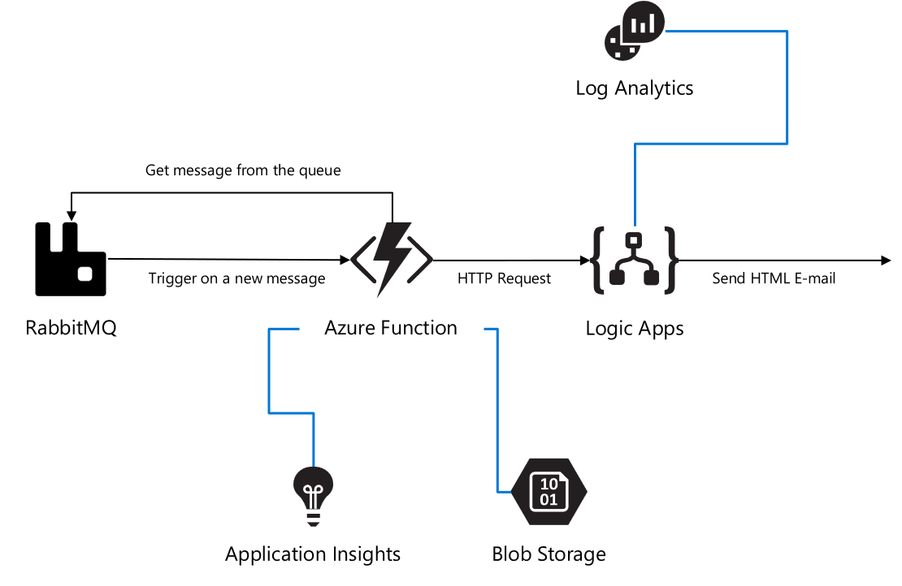

# rabbitmq-af
A fully automated DevOps deployment of an Azure Function which triggers on new messages in RabbitMQ, passing the message through to Logic Apps to send an HTML E-mail based on the content of the message. Setup with services like: Azure Function App, Logic Apps, Storage Account, Application Insights (for logging and monitoring the Function App) and Log Analytics (for logging metrics from Logic Apps).

The architecture is based on this article about triggering a Logic App from a Azure Function:
https://docs.microsoft.com/en-us/azure/logic-apps/logic-apps-scenario-function-sb-trigger

And this Github Post on how to trigger an Azure Function on a RabbitMQ queue message:
https://github.com/Azure/azure-functions-rabbitmq-extension

And this blog post on how to create a well-formated E-mail in Logic Apps:
https://blog.sandro-pereira.com/2020/01/26/logic-apps-how-to-send-a-well-formatted-html-email-notification-with-office-365-outlook-connector/

## Azure Architecture

## Step by Step installation

### Step 1: In the Azure Portal create a Service Principal
In the Azure Cloud Shell (https://shell.azure.com): 
- az ad sp create-for-rbac --name [your-service-principal-name]

Copy the JSON Output! We'll be needing this information to create the service connection in Azure DevOps.

### Step 2: Generate your Azure DevOps Project for Continuous Integration & Deployment with the Azure DevOps Generator
- In the devops folder of this repo the Azure DevOps template is included. Download it.
- Login with your account and open the DevOps Generator: https://azuredevopsdemogenerator.azurewebsites.net/environment/createproject?enableextractor=true
- Choose a custom template and point to the zip-file in the devops folder. This repo will be imported into Azure DevOps and Pipelines are created for you.

You can find the documentation on the Azure DevOps Generator here: https://vstsdemodata.visualstudio.com/AzureDevOpsDemoGenerator/_wiki/wikis/AzureDevOpsGenerator.wiki/58/Build-your-own-template

### Step 3: In Azure DevOps, create a service connection
- Login with your account Azure DevOps. Go to the Project Settings of the DevOps Project you've created in step 2.
- Go to Service Connections.
- Create a new service connection, choose Azure Resource Manager, next.
- Select Service Principal (manual).
- Fill in the Subscription Id, Subscription Name.
- Copy the appId from step 1 in "Service Principal Id" and the password from step 1 in "Service Principal key". Give the service connection a name and verify the connection.
- Tick "Grant access permission to all pipelines. Save.

### Step 4: In Azure DevOps, update the Variables Group.
- Go to Pipelines, Library. Click on the Variable group "Shared Resources".
- Tick "Allow access to all pipelines.
- Update the values of the variables to match your naming conventions needs. I've put in some generic naming, but you need to update the variables. Otherwise, the creation of some services will fail, because they've been already used.
- Don't forget to save.

### Step 5: In Azure DevOps, update the Build pipeline and Run it.
- Go to Pipelines, Pipelines.
- Select "Build Azure Integration RabbitMQ Pattern-CI", Edit.
- In Tasks, select the Tasks which have the explaination mark "Some settings need attention", and update Azure Subscription to your Service Principal Connection.
- Save & queue.
- Click the Agent Job to check the progress. Check if everything is created correctly, because of the unique naming for some services.
- Keep in mind that the CLI scripts will check if the resource is already created, before creating. I've used an ARM Template for the deployment of the Application Insights, because I wanted to automatically integrate it with the API Management Instance I've just created. This is not yet supported in AZ CLI at the moment of writing this blog.

### Step 6: In Azure DevOps, update the Release pipeline and Run it.
- Go to Pipelines, Releases.
- Select "Release Azure Integration RabbitMQ Pattern-CD", Edit.
- In Tasks, select the Tasks which have the explaination mark "Some settings need attention", and update Azure Subscription to your Service Principal Connection.
- In Variables, update the variables to match the naming you used in the Build pipeline.
- In the Pipeline, Click on the Pre-deployment conditions (bulb next to each stage), and Check Pre-deployment approvals and enter your e-mail as approver.
- Save & Create Release.

## Contributing
This project welcomes contributions and suggestions. Most contributions require you to agree to a Contributor License Agreement (CLA) declaring that you have the right to, and actually do, grant us the rights to use your contribution. For details, visit https://cla.microsoft.com.

When you submit a pull request, a CLA-bot will automatically determine whether you need to provide a CLA and decorate the PR appropriately (e.g., label, comment). Simply follow the instructions provided by the bot. You will only need to do this once across all repos using our CLA.

This project has adopted the Microsoft Open Source Code of Conduct. For more information see the Code of Conduct FAQ or contact opencode@microsoft.com with any additional questions or comments.